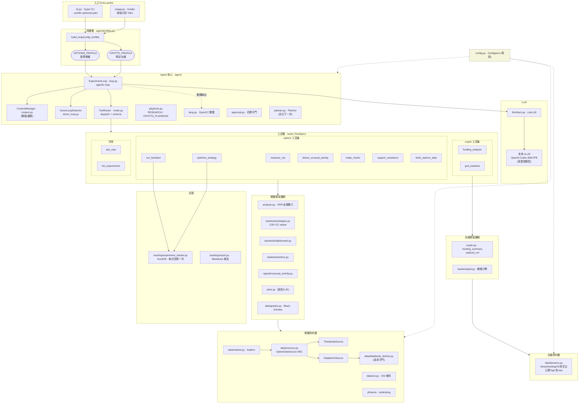
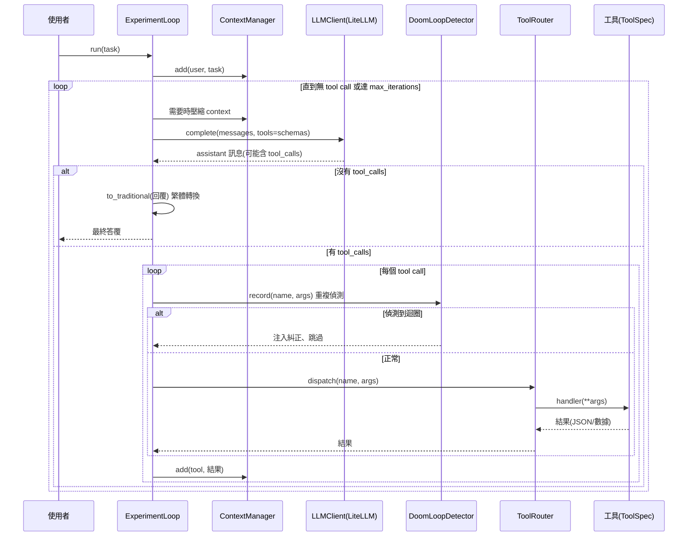
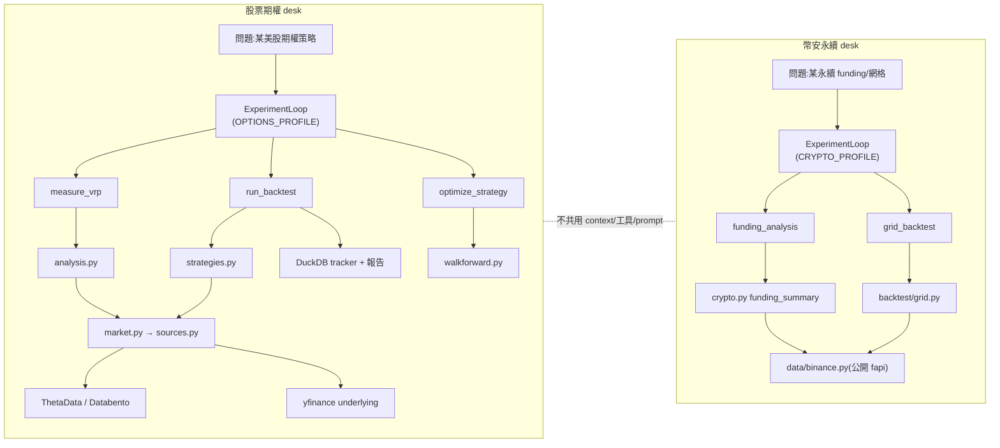

# OptionPilot 架構圖

OptionPilot 是一個自主研究 agent(「期權/永續的 ML intern」),用本地 LLM(Qwen)依循嚴謹、誠實的回測方法論研究策略。專案有**兩個互相隔離的研究台**,共用同一套 agent 核心:

| 研究台 | profile | 標的 | 資料來源 | 主要工具 |
|---|---|---|---|---|
| **股票期權** | `options` | 美股期權 | ThetaData(免費)/ Databento(付費)+ yfinance | VRP 篩選、CSP/CC/wheel 回測、walk-forward、異常活動、圖表、支撐壓力 |
| **幣安永續** | `crypto` | Binance USDⓈ-M 永續(含美股永續 NOKUSDT/AAPLUSDT…) | `fapi.binance.com` 公開資料(免 key) | 資金費率 carry 分析、網格回測 |

兩台各自擁有獨立的 system prompt、playbook、工具集與對話 context,**永不混用**(見 `agent/profiles.py`)。

---

## 1. 分層架構

---

## 2. Agent loop 執行流程

`ExperimentLoop.run(task)`(`agent/loop.py`)的單回合循環,借用 ml-intern 的結構:

> 花費守門:只有付費下載(Databento)會經 `approval.py`;估價/快取命中不收費也不詢問。GUI 用 `auto_spend`、CLI 互動模式用 `interactive_spend`(無 TTY 時預設拒絕,避免靜默花錢)。

---

## 3. 兩個研究台的資料流(隔離)

---

## 4. 模組速查

| 路徑 | 角色 |
|---|---|
| `cli.py` | Typer CLI;`--profile` 選研究台,互動/headless 兩種模式 |
| `ui/app.py` | Gradio GUI;`gr.Tabs` 兩分頁,各自獨立 session,工具呼叫即時串流、圖表 inline |
| `config.py` | `Config`(env > 預設):模型、api_base、資料源、花費上限、快取/runs 目錄 |
| **agent/** | |
| `agent/profiles.py` | `Profile` 抽象 + `OPTIONS_PROFILE`/`CRYPTO_PROFILE` + `build_loop()` 工廠 |
| `agent/loop.py` | `ExperimentLoop` agentic 迴圈;兩套 system prompt |
| `agent/context.py` | `ContextManager`:對話歷史 + token 壓縮 |
| `agent/doom_loop.py` | `DoomLoopDetector`:偵測重複 tool 呼叫並糾正 |
| `agent/router.py` | `ToolRouter`:工具註冊、OpenAI schema 匯出、dispatch |
| `agent/planner.py` | `Planner`:自主提出下一步實驗(LLM + JSON) |
| `agent/playbook.py` | `RESEARCH_PLAYBOOK`(期權)/ `CRYPTO_PLAYBOOK`(永續)方法論 |
| `agent/lang.py` | `to_traditional()`:OpenCC s2twp 簡→繁 |
| `agent/approval.py` | 付費下載的花費守門(auto / interactive) |
| **llm/** | |
| `llm/client.py` | LiteLLM 薄包裝;本地 vLLM 或雲端模型皆可 |
| **tools/** | |
| `tools/base.py` | `ToolSpec` 契約 + OpenAI function schema |
| `tools/__init__.py` | `OPTIONS_BUILDERS` / `CRYPTO_BUILDERS` 分組 + `build_tools` |
| `tools/*.py` | 各工具:measure_vrp / run_backtest / optimize_strategy / detect_unusual_activity / make_charts / support_resistance / fetch_options_data / **funding_analysis** / **grid_backtest** / ask_user / list_experiments |
| **領域邏輯** | |
| `analysis.py` | VRP(隱含 vs 實現波動,上/下行分離)、支撐壓力 |
| `crypto.py` | 永續 funding 摘要(年化、誰付誰、carry 方向)、K 線實現波動 |
| `backtest/strategies.py` | CSP / covered call / wheel 回測(真實 bid/ask 成交、成本) |
| `backtest/grid.py` | 長倉網格引擎(已實現格利 vs 套牢、跌穿區間、含 funding 拖累) |
| `backtest/walkforward.py` | walk-forward 最佳化(防過擬合) |
| `backtest/metrics.py` | sharpe / max drawdown / win rate / 摘要 |
| `signals/unusual_activity.py` | 異常期權活動 + put/call flow |
| `plots.py` | matplotlib 圖表(Agg、Noto CJK TC 繁體標題) |
| `data/greeks.py` | Black-Scholes 定價 + 隱含波動率求解 |
| **資料層** | |
| `data/market.py` | tools 用的 loaders(期權鏈 + underlying) |
| `data/sources.py` | `OptionDataSource` ABC + ThetaData/Databento 實作 + 正規化 schema |
| `data/databento_fetcher.py` | Databento 下載 + 成本守門(`CostGuardError`/`FetchDenied`) |
| `data/osi.py` | OSI 期權代碼解析 |
| `data/binance.py` | Binance USDⓈ-M 公開資料(klines/funding/OI/多空比),免 key |
| **追蹤** | |
| `tracking/experiment_tracker.py` | DuckDB,每次回測存一列供比較 |
| `tracking/report.py` | 回測 Markdown 報告 |

> **Phase-2 佔位(尚未接線)**:`backtest/engine.py`(訊號→部位 P&L)、`models/baseline.py`。目前研究流程不依賴它們。

---

## 5. 外部相依

- **LLM 服務**:本地 vLLM(`scripts/serve_local.sh`,Qwen3-Coder-30B-A3B-Instruct-FP8)或任何 LiteLLM 支援的雲端模型。
- **期權資料**:ThetaData 本地終端(免費,port 25503)/ Databento OPRA(付費,成本守門);underlying 用 yfinance。
- **永續資料**:Binance USDⓈ-M 公開 REST(`fapi.binance.com`),免 API key、不下單。
- **打包**:uv / hatchling;測試 pytest(目前 69 passed)。
